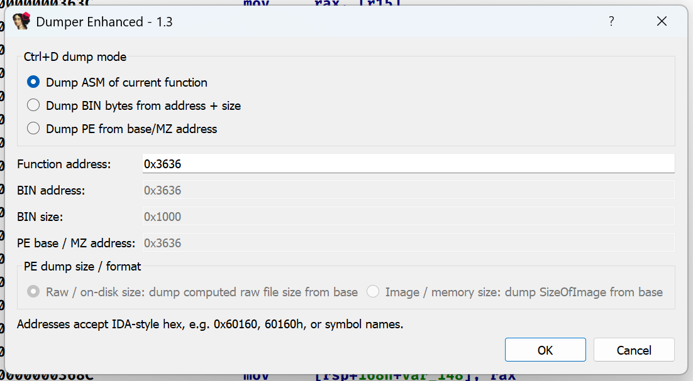
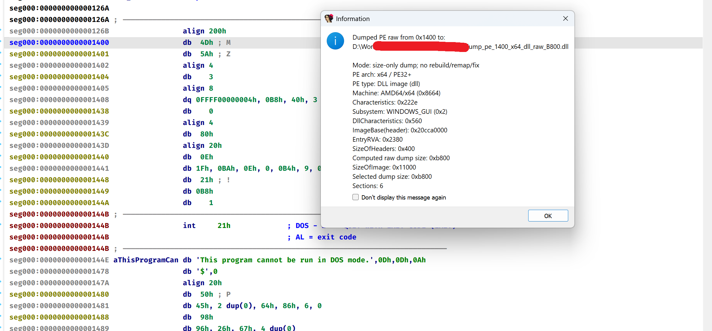

### EnhanceDumper

viết plugin dump mem cho nhanh, đỡ phải lần nào cũng viết 1 đoạn dump bé tí.

Hiện tại thì có 3 mode, dump dải byte, dump mã asm của hàm, dump PE raw/image.

Dump PE(dump theo sizeofimage/sizeofrawdata, không hỗ trợ fix).

### Installation

Tải hết về rồi quăng vào folder plugin %AppData%\Hex-Rays\IDA Pro\plugins.
